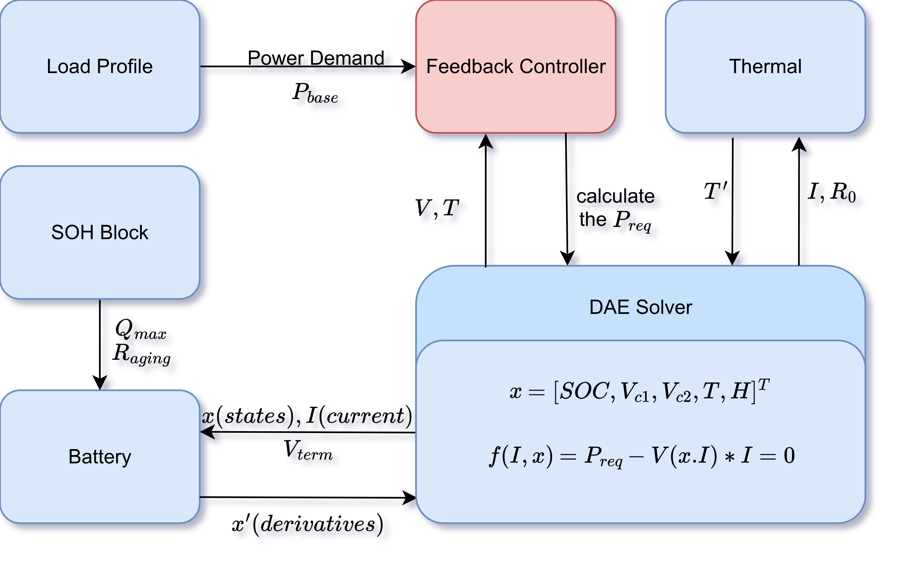
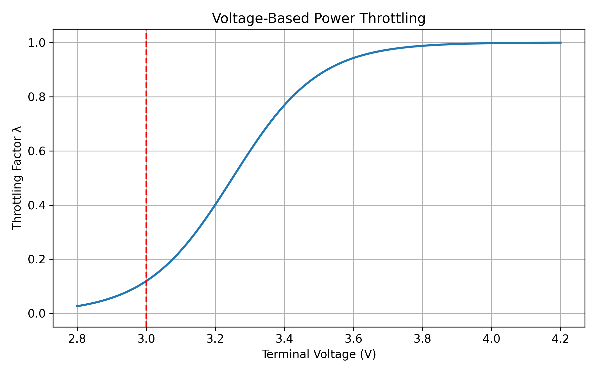
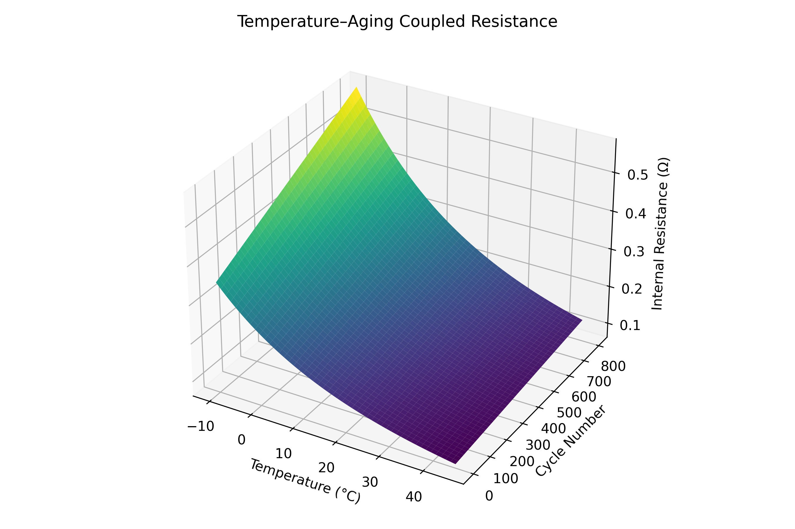
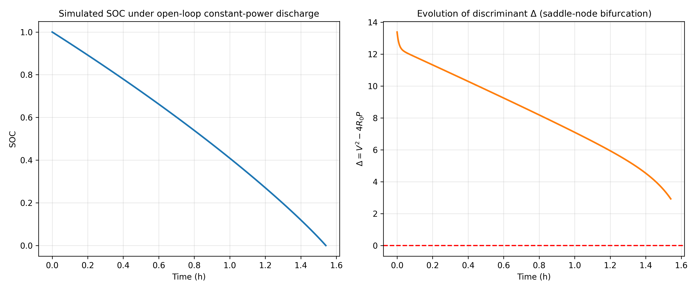
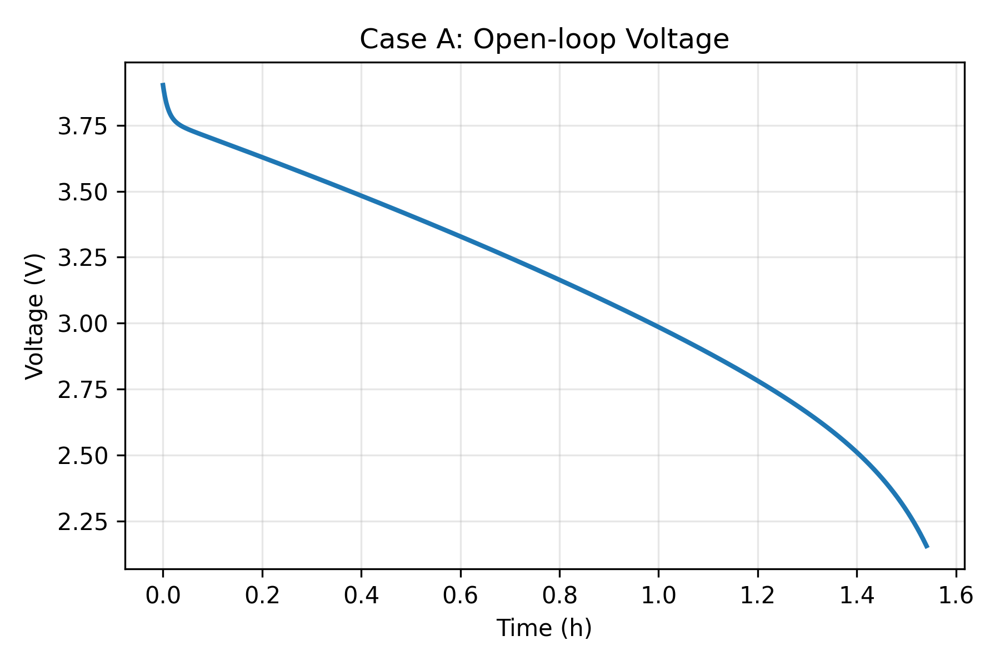
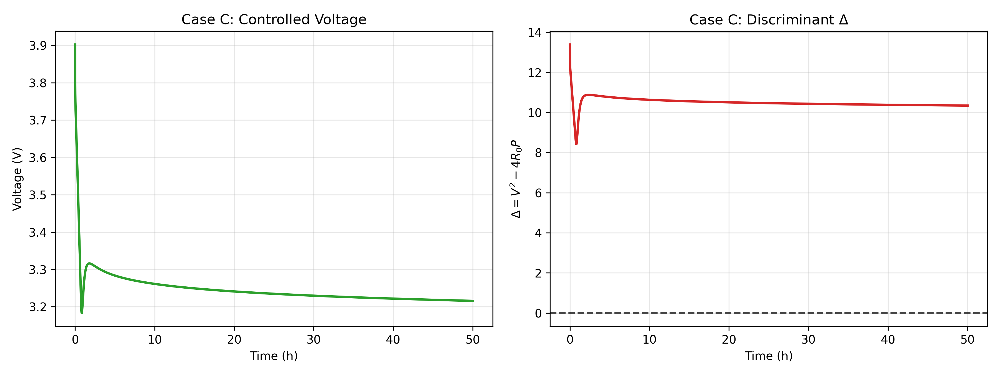
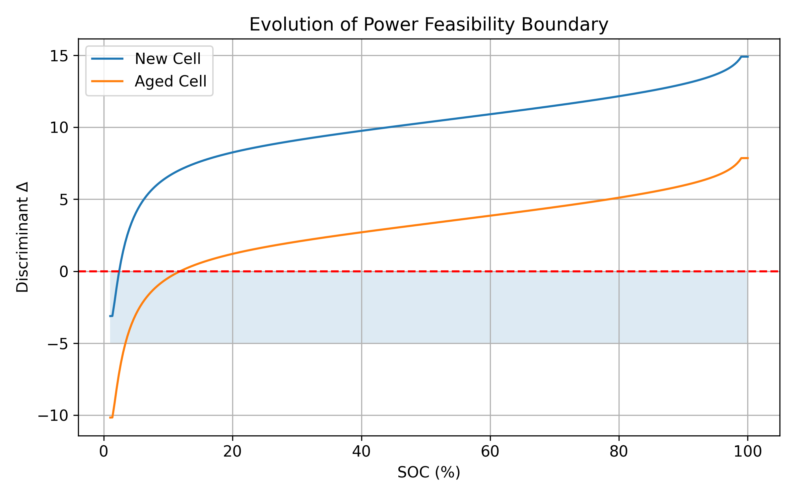
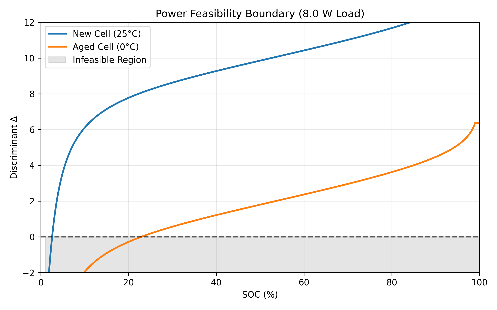
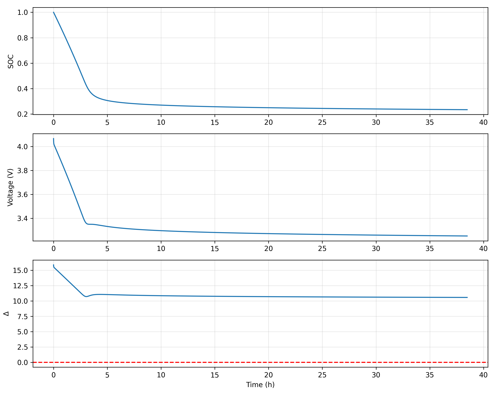

# 考虑老化机制与系统反馈的智能手机锂离子电池 TTE 预测模型
**A Multi-Physics Continuous-Time Mechanistic Model for Smartphone Battery Discharge Prediction Considering Aging and System Feedback**

> 本倉庫採用了ai進行語言上潤色以及翻譯，故帶有一定的ai風格，請諒解
> 
> *以下内容仅是草稿说明，最终版本内容需要查看仓库中的pdf文件*
> 
> *The following content is only a draft; please read the PDF file for the complete version.*

## 1. Introduction

### 1.1 背景：非线性耦合导致的系统失稳
现代智能手机的电源管理不仅受限于电化学储能，更受限于负载功率对端电压的非线性正反馈。在低温与老化场景下，电池内阻 $R_{0}$ 显著升高，使得功率平衡方程 $P=V \cdot I$ 演变为一个典型的代数环问题。当电池无法满足负载的瞬时功率需求时，系统将跨越物理可行域的边界，导致瞬态电压崩溃（Voltage Collapse）。本文旨在构建一个 Index-1 的微分代数方程（DAE）系统，刻画这种从稳态运行到动力学失稳的临界演化过程。

传统的库伦计数法（Coulomb Counting）和开环等效电路模型作出的假设：
1. 负载功率恒定或外部给定；
2. 电池参数缓慢变化；
3. 电压-电流关系始终存在唯一的物理解；
这些假设在**高负载+老化+低温**等场景下会出现显著失真的情况，已无法应对这些非线性工况。

### 1.2 Work
结合我们建立一个包含 **SOH（健康状态）**、**电压滞后** 和 **闭环功率控制** 的连续时间微分-代数方程（DAE）模型，以精确预测剩余放电时间（TTE）及电压崩溃临界点的目标，我们决定在本文中共提出一个连续时间，多物理场耦合，含老化与系统反馈的微分-代数方程(DAE)模型，用于预测：
1. 剩余可用时间 Time-to-Empty, TTE;
2. 电压崩溃的临界边界；
3. 不同老化程度下的安全运动功率区间；

## 2. Problem Analysis

主要需要克服的问题：
1. **多物理场耦合**：电化学、热力学与电路特性的强耦合，以及与等效电路参数的高度依赖；
2. **老化效应 (Aging Effect)**：循环老化驱动的非线性退化，随着循环次数增加，内阻升高与容量衰减导致的性能退化，容量衰减与内阻增长对系统稳定性的影响远大于对 SOC 的影响；
3. **负载随机性与系统反馈**：负载不仅随机，还受操作系统的热节流（Throttling）机制控制，同时，操作系统的热节流与低压保护使负载功率成为电池状态的隐函数，形成代数环。

**代数环的动力学本质：**
在传统的 $ODE$ 模型中，电流 $I$ 通常会作为外生输入变量，然而，再考虑到系统级的反馈的闭环模型中，电流时由瞬时功率平衡决定的隐函数；At each time instant, the battery current is implicitly determined by enforcing instantaneous power balance, resulting in an algebraic constraint. 系统状态向量的演化受限于功率平衡流形（Power Balance Manifold），构成微分-代数方程组 (DAE)。

## 3. Symbol and Assumptions

### 3.1 Symbol Description
| 符号 (Symbol)            | 定义 (Definition)                      | 单位 (Unit)  |
| :--------------------- | :----------------------------------- | :--------- |
| $SOC(t)$               | 电池荷电状态 (State of Charge)             | 无量纲 (0~1)  |
| $V_{C1}(t), V_{C2}(t)$ | 极化电容支路电压 (Polarization Voltages)     | V          |
| $H(t)$                 | 滞后状态变量 (Hysteresis State)            | 无量纲 (-1~1) |
| $T(t)$                 | 电池核心温度 (Battery Core Temperature)    | K          |
| $I_{batt}(t)$          | 电池放电电流 (Discharge Current)           | A          |
| $V_{term}(t)$          | 电池端电压 (Terminal Voltage)             | V          |
| $V_{OCV}$              | 包含滞后的开路电压 (OCV with Hysteresis)      | V          |
| $V_{eq}$               | 电池平衡电势 (Equilibrium Potential)       | V          |
| $R_0, R_1, R_2$        | 欧姆/快极化/慢极化内阻 (Internal Resistances)  | $\Omega$   |
| $C_1, C_2$             | 极化电容 (Polarization Capacitances)     | F          |
| $Q_{max}(N_{cyc})$     | 当前循环下的最大可用容量 (Actual Capacity)       | Ah         |
| $N_{cyc}$              | 电池等效循环次数 (Cycle Number)              | 无量纲        |
| $P_{base}(t)$          | 系统基础功率需求 (Base Power Demand)         | W          |
| $P_{req}(t)$           | 经节流后的实际负载功率 (Actual Load Power)      | W          |
| $\lambda(V, T)$        | 系统功率反馈节流因子 (Throttling Coefficient)  | 无量纲 (0~1)  |
| $\eta_{pmic}$          | 电源转换效率 (Power Conversion Efficiency) | 无量纲 (0~1)  |
| $m C_p$                | 电池等效热容 (Total Heat Capacity)         | J/K        |
| $hA$                   | 综合散热系数 (Heat Transfer Coefficient)   | W/K        |
| $T_{amb}$              | 环境温度 (Ambient Temperature)           | K          |
| $E_a$                  | 内阻活化能 (Activation Energy)            | J/mol      |
| $TTE$                  | 剩余放电时间 (Time-to-Empty)               | min        |

### 3.2 Fundamental Assumptions

1. 集总参数与均匀性：将电池视作一个集总系统，假设电池内部温度、浓度，电化学状态在单体尺度上的分布均匀，该假设适用于手机单体电芯在中低倍率（≤2C）放电工况；

2. 双重老化机制：电池衰退由“日历老化”（忽略）和“循环老化”组成，主要表现为 SEI 膜增厚导致的内阻增加和活性锂损失导致的容量衰减；

3. 个体差异正态分布：同批次电池的初始参数（$R_{0}, Q_{nom}$）服从正态分布 $N(\mu, \sigma^2)$，所以采用同批次电池在初始容量与内阻上的离散性通过正态分布扰动项建模，The stochastic perturbations are introduced solely to reflect manufacturing variability and are not treated as random variables for inference, but as bounded uncertainty terms constrained by empirical degradation envelopes.

4. **Separation of Scales and Quasi-static Approximation**: The timescale of capacity degradation and resistance growth (cycles/months) is several orders of magnitude larger than that of a single discharge event (minutes/hours). Consequently, aging-dependent parameters ($Q_{max}, R_{aging}$) are treated as **quasi-static constants** during the TTE prediction interval $[0, t_{end}]$. They are initialized as functions of $N_{cyc}$ at $t=0$ and remain invariant during the integration of the DAE system. (**尺度分离与准静态近似**：电池老化过程（$N_{cyc}$）的时间尺度（天/月）远大于单次放电过程的时间尺度（分钟/小时）。因此，在单次 TTE 预测仿真中，老化相关参数 $Q_{max}, R_{aging}$ 被视为准静态常数（Quasi-static constants），其值仅在仿真初始时刻根据 $N_{cyc}$ 确定，在积分过程中不随 $t$ 演化。)
5. 分级关机逻辑假设：
- 软关机 (Soft Shutdown)：$V_{term}\le 3.4V$ 时系统触发省电模式（限制功率）；
- 硬关机 (Hard Cutoff)：$V_{term}\le 3.0V$ 或发生功率崩溃（Power Collapse）即代数约束上不存在实根时，强制断电；
In the proposed model, hard cutoff is triggered either by voltage protection or by the loss of feasibility of the algebraic power constraint.

## 4. Mathematical Modeling

**Figure 3.0. Architecture of the coupled DAE-based battery discharge model with aging, thermal dynamics, and closed-loop power feedback.** 

Electrical dynamics, thermal evolution, aging states, and system-level feedback are **bidirectionally coupled**, producing intrinsic algebraic loops between terminal voltage, current, and power demand. Consequently, the system cannot be represented by a pure ODE and must be formulated as a **DAE system**.

定义系统状态向量:

$$\mathbf{x}(t) = [SOC(t), V_{C1}(t), V_{C2}(t), T(t), H(t)]^T$$

### 4.1 submodule 1: 考虑老化与个体差异的参数模型 (Aging & Variance)
在仿真开始前，根据电池的循环次数 $N_{cyc}$ 和个体差异因子 $\delta$，确定当前电池的物理参数。

**Figure 2.1 Capacity degradation trajectories of four lithium-ion cells from the NASA battery aging dataset.** 

Despite similar initial capacities, substantial dispersion in degradation rates is observed, motivating the introduction of cycle-dependent aging parameters and bounded uncertainty in the proposed model.

Based on the NASA lithium-ion battery aging dataset (B0005, B0006, B0007, B0018), the observed capacity fade after 130–170 discharge cycles:

| Battery | Cycles | Capacity Fade |
| :-----: | :----: | :-----------: |
|  B0005  |  168   |    28.62%     |
|  B0006  |  168   |    41.75%     |
|  B0007  |  168   |    24.25%     |
|  B0018  |  132   |     7.71%     |

These values are used to constrain the feasible range of aging-related parameters in the proposed model.

**A. 容量衰减 (Capacity Fade)**
遵循 SEI 膜生长的平方根法则：
$$ Q_{max}(N_{cyc}) = Q_{design} \cdot (1 + \delta_Q) \cdot \left( 1 - \alpha_{sei} \sqrt{N_{cyc}} \right) $$
*其中 $\delta_Q \sim N(0, 0.02)$ 为个体容量差异。* The square-root law is applied at the cycle level and does not imply continuous-time differentiability of capacity with respect to time. A lower bound is imposed on $Q_{max}$ to prevent nonphysical negative capacity during long-term extrapolation. The parameter $\alpha_{sei}$ is calibrated such that $\alpha_{sei} \in [0.018, 0.032]$ ensuring consistency with empirical degradation trajectories.

**B. 内阻增长 (Resistance Growth)**
内阻随循环次数线性或指数增长（取决于化学体系，此处采用线性简化）：
$$ R_{aging}(N_{cyc}) = (1 + \beta_{res} N_{cyc}) \cdot (1 + \delta_R) $$

*其中 $\delta_R \sim N(0, 0.03)$ 为个体阻抗差异。* 

Empirical studies on the NASA dataset indicate that, Within the first 150–200 cycles, experimental observations indicate that the effective DC internal resistance increases monotonically and can be approximated by a linear function. Therefore, a linearized aging model is adopted to balance physical fidelity and numerical tractability.

### 4.2 submodule 2: 闭环负载与反馈控制 (Closed-loop Load Model)
为了模拟真实的手机系统，负载不再是恒定的，而是受电压和温度反馈控制的变量。

**A. 基础功率需求**：$P_{base}(t) = \frac{1}{\eta} \left( P_{disp}(t) + P_{cpu}(t) + P_{net}(t) \right)$

**B. 系统反馈因子 (System Throttling)**：

引入调节因子 $\lambda(t) \in [0, 1]$，模拟电源管理逻辑：

$$ \lambda(t) = \min \left( \underbrace{\frac{1}{1+e^{(T - 45)/2}}}_{\text{Thermal Throttling}}, \quad \underbrace{\tanh(k_v (V_{term} - 3.0))}_{\text{Low Voltage Throttling}} \right) $$

$(T - T_{crit}), \quad T_{crit}=45^\circ\mathrm{C}$，Temperature is expressed in degrees Celsius in the throttling logic for consistency with system-level thermal limits. 
可将其描述为一个软切换函数 Soft-switching function：

$$ \lambda(V) = \frac{1}{2} \left[ 1 + \tanh\left( \frac{V - V_{crit}}{\epsilon} \right) \right] $$

**Figure 3.2. Voltage-Based Power Throttling.** 

The throttling function is not required to be smooth everywhere, as it represents discrete system-level power management logic rather than intrinsic electrochemical dynamics.

**C. 实际负载**：实际负载功率 $P_{req}$ 是电压与温度的隐函数：
$P_{req}(t) = P_{base}(t) \cdot \lambda(t)$ 或 $P_{req} = P_{base} \cdot \lambda(V, T)$

### 4.3 submodule 3: 电化学动态 (Electrochemical Dynamics)

**A. 容量归一化的 SOC 动态方程**

$$ \frac{dSOC}{dt} = -\frac{I_{batt}(t)}{Q_{max}}, \qquad Q_{max} \text{ expressed in Coulombs (As)} $$

**B. 包含滞后的 OCV 模型 (OCV with Hysteresis)**

引入滞后状态变量 $H(t)$ 以修正充放电电压差：

$$ V_{OCV}(SOC, H) = V_{eq}(SOC) + M(SOC) \cdot H(t) $$

The OCV curve is treated as an empirical monotonic function calibrated from typical smartphone Li-ion cells, rather than a chemistry-specific equilibrium potential.

滞后项的动态方程：

$$ \frac{dH}{dt} = -\kappa |I_{batt}| (H - \text{sgn}(I_{batt})) $$

*当持续放电时，$H \to -1$，表现为电压低于平衡电势 $V_{eq}$。* In this work, only discharge scenarios are considered; therefore, the hysteresis state converges to $(H \to -1)$, and the sign function reduces to a constant.

**C. 极化电压 (Dual-RC)**
$$ \frac{dV_{Ci}}{dt} = -\frac{1}{R_i C_i} V_{Ci} + \frac{1}{C_i} I_{batt}, \quad i=1,2 $$

#### Subsubsection：Effect of Aging on Voltage Hysteresis and Polarization

While voltage hysteresis is primarily introduced to capture the intrinsic charge–discharge asymmetry of lithium-ion batteries, aging mechanisms are known to further amplify this effect. From a physical perspective, the growth of the solid electrolyte interphase (SEI) layer and the degradation of active material increase the charge-transfer resistance and slow down interfacial kinetics. As a result, a larger overpotential is required to sustain the same current, which manifests macroscopically as enhanced polarization and increased voltage hysteresis during discharge.

In principle, this aging-induced asymmetry could be explicitly modeled by introducing aging-dependent hysteresis parameters or additional state variables. However, such an approach would significantly increase model complexity and introduce parameters that are difficult to identify from typical smartphone-level measurements. Moreover, in the present study, the focus is restricted to monotonic discharge scenarios, where the hysteresis state rapidly converges to a saturated value and does not exhibit pronounced dynamic reversal.

Therefore, an engineering approximation is adopted: the effect of aging on polarization asymmetry is implicitly captured through the aging-dependent ohmic resistance $R_0(N)$. As internal resistance increases with cycle number, the effective voltage drop and associated polarization losses are magnified, indirectly enhancing the observable hysteresis effect without explicitly modifying the hysteresis dynamics. This approximation preserves numerical stability and identifiability while retaining the dominant impact of aging on terminal voltage behavior.

Aging-induced polarization asymmetry is implicitly captured through the increase of ohmic resistance, while explicit aging-dependent hysteresis dynamics are left for future refinement.

### 4.4 submodule 4: 热力学耦合 (Thermodynamics)

**Figure 3.4. $R_0$ Temperature-Cycle Surface.** 这标志着系统进入了‘内阻占导（Resistance-Dominated）’态，此时电池更像一个发热器而非电源。

**A. 阿伦尼乌斯-老化耦合内阻**：这是模型的核心非线性源：

$$ R_0(T, N_{cyc}) = R_{base} \cdot R_{aging}(N_{cyc}) \cdot \exp \left[ \frac{E_a}{R_g} \left( \frac{1}{T} - \frac{1}{T_{ref}} \right) \right] $$

**B. 热平衡方程**：

$$ m C_p \frac{dT}{dt} = I_{batt}^2 R_0 - hA(T-T_{amb}) $$

Thermal parameters are selected to reproduce qualitative trends rather than calibrated absolute temperature profiles. Only the ohmic resistance ($R_0$) is considered as the dominant heat generation source, while polarization losses are neglected for simplicity.

### 4.5 功率平衡约束与代数环分析 (System Coupling)

定义有效电压：$V_{est} = V_{OCV}(SOC, H) - V_{C1} - V_{C2}$。端电压 $V_{term}$ 与电流 $I$ 的代数约束关系如下：
$$ V_{term} = V_{OCV}(SOC, H) - V_{C1} - V_{C2} - I_{batt} R_0(T, N_{cyc}) $$

结合负载功率需求 $P_{req}$，功率平衡方程 $f(I, \mathbf{x}) = 0$：

$$ \boxed{ R_0(T, N_{cyc}) \cdot I_{batt}^2 - [V_{OCV}(SOC, H) - V_{C1} - V_{C2}] \cdot I_{batt} + P_{req}(t) = 0 } $$

这是模型的动力学核心。公式实际上是一个关于 $I_{batt}$ 的非线性代数方程：

$$ f(I_{batt}) = R_0 I_{batt}^2 - V_{est} I_{batt} + P_{req} = 0 $$
方程有解：

$$ I_{batt} = \frac{V_{est} \pm \sqrt{V_{est}^2 - 4 R_0 P_{req}}}{2 R_0} $$

从动力学角度来看，电流 $I$ 是由代数方程定义的隐函数，解的存在性取决于判别式：$\Delta = V_{est}^2 - 4 R_0 P_{req}$。必须选择带有负号的分支：

1. 负号分支$I^* = \frac{V_{est} - \sqrt{\Delta}}{2 R_0}$对应的是低电流，高电压工作点，是电池稳态运行区；
2. 非负号分支对应高电流低电压状态，会导致正反馈出现热失控和瞬时电压坍塌 Voltage Collapse。

当 $\Delta \to 0$ 时，系统抵达物理可行域的边界（Discriminant Manifold），此时 the Jacobian with respect to the algebraic variable $\partial f / \partial I$ becomes singular。

$Jacobian$ 矩阵为：$\frac{\partial f}{\partial I} = 2 R_0 I - V_{est}$。只要判别式 $\Delta > 0$，则 $\left.\frac{\partial f}{\partial I}\right|_{I=I^{*}}=-\sqrt{\Delta}$，意味着系统属于 $Index-1 DAE$。当系统逼近临界点（$\Delta \to 0$）时，系统抵达边界，Jacobian 趋于奇异。数值模拟中表现为系统刚性（Stiffness）的无穷大。

The critical point of voltage collapse is analyzed as a **saddle-node bifurcation**, following the theoretical framework established by **Dobson and Chiang [5]**. 

当两个解分支在 $\Delta = 0$ 处相遇并消失，这构成了典型的鞍结分岔。这就是手机“瞬间关机”的 numerical manifestation。

### 4.6 数值求解策略 (Numerical Implementation Strategy)
由于系统在截止点附近具有强刚性（Stiffness），不能简单使用欧拉法。
1. **求解器**：Python `scipy.integrate.solve_ivp` (采用 `BDF` 或 `Radau` 方法);

2. **每步迭代逻辑**：

* 根据当前状态 $(T, SOC, \dots)$ 更新 $R_0, V_{OCV}$;
* 计算反馈因子 $\lambda$ 得到 $P_{req}$;
* 求解代数约束方程得到 $I_{batt}$（取较小正根）;
* 若 $\Delta < 0$，判定为 **Power Collapse**，仿真终止;
* 计算状态导数 $d\mathbf{x}/dt$;

Although the system contains algebraic loops, the index of the DAE remains low due to the explicit quadratic form of the power constraint, enabling stable integration via implicit solvers.

### 4.7 Multi-scale Aging Evolution Across Discharge Cycles

The aging process evolves over a timescale that is orders of magnitude larger than that of a single discharge event. Therefore, aging dynamics are not directly coupled into the fast-time DAE system, but modeled separately as a slow-time process across cycles.

The fast time scale is defined as the discharge time $t \in [0, TTE]$ , while the slow time scale is represented by the equivalent cycle number $N \in \mathbb{N}$ , which characterizes cumulative aging across multiple discharge events. Within one discharge event, the aging-related parameters $R_0$ and $Q_{\max}$ are treated as quasi-static constants, since their evolution occurs over a much longer timescale than the discharge dynamics.

Following the commonly adopted square-root degradation law associated with SEI growth, the maximum available capacity is modeled as:  

**$$
Q_{\max}(N) = Q_{\max}(0)\left(1 - k_Q \sqrt{N}\right)
$$**

The internal resistance growth is approximated by a linear function of cycle number, which provides a numerically stable first-order representation of aging effects:

**$$
R_0(N) = R_0(0)\left(1 + k_R N\right)
$$**

At the beginning of each discharge simulation, the aging parameters are updated according to the slow-time aging laws, and then held constant during the fast-time DAE integration. Fully coupling aging dynamics into the fast-time DAE system would result in a stiff multi-scale DAE and is beyond the scope of this work.

### 4.8 Cycle-to-Cycle Aging Evolution and Slow-Time State Update

The degradation of lithium-ion batteries is governed by electrochemical processes evolving over a timescale that is several orders of magnitude slower than that of a single discharge event. While the fast-time dynamics of discharge are captured by the DAE system described in Sections 4.3–4.6, the long-term aging behavior must be modeled on a separate slow-time scale.

In this work, battery aging is formulated as a cycle-indexed discrete-time process. Each discharge event corresponds to one aging step, indexed by the equivalent cycle number (N). At the beginning of the (k)-th discharge cycle, the aging-dependent parameters are updated according to empirically motivated degradation laws, and are then treated as quasi-static constants throughout the subsequent fast-time DAE simulation.

Specifically, the evolution of the maximum available capacity and the ohmic internal resistance is modeled as  
$$
Q_{\max}^{(k+1)} = Q_{\max}^{(k)} \left(1 - k_Q \sqrt{\Delta N_k}\right),  
$$
$$
R_0^{(k+1)} = R_0^{(k)} \left(1 + k_R \Delta N_k\right),  
$$
where $k_Q$ and $k_R$ denote the capacity fade and resistance growth coefficients, respectively, and $\Delta N_k$ represents the effective cycle increment associated with the (k)-th discharge event.

Within each discharge cycle, the updated parameters $Q_{\max}^{(k)}$ and (R_0^{(k)}) are held constant, and the coupled DAE system is integrated until a shutdown condition is reached. The resulting discharge duration defines the time-to-empty $TTE^{(k)}$, while the terminal shutdown mechanism (energy depletion, voltage cutoff, or power collapse) is recorded as an outcome of the cycle.

This two-time-scale formulation decouples the fast electro-thermal dynamics from the slow degradation process, enabling stable numerical integration while preserving the essential physical mechanisms of aging-induced performance deterioration.

## 5. Test the Models

### Algorithm 1: Cycle-Aware TTE Simulation Framework

Algorithm 1 Cycle-Aware Battery Discharge Simulation
Input: Initial SOC0, Qmax(0), R0(0), Ncycles
For k = 1 to Ncycles do
    Update aging parameters Qmax(k), R0(k)
    Initialize DAE states
    Solve coupled DAE system until shutdown
    Record TTE(k), SOCcrit(k), shutdown mode
End For

### 5.1 稳定性分析与相平面 (Stability & Phase Plane Analysis)
为了量化“瞬间死机”的边界，我们不应仅将其视为一个数值报错，而应将其视为动力学系统中的鞍节点分叉 (Saddle-Node Bifurcation)。

**Figure 4.1. DAE SOC and Discriminant Open-Loop.** 

Note that $\Delta$ remains positive at $SOC \approx 0$ for this specific $P_{base}$, implying the cut-off is energy-limited rather than stability-limited. (注意在此功率下，$Δ$ 在 SOC 归零时仍为正，说明关机是受能量限制而非稳定性限制)

**A. 判别式流形 (Discriminant Manifold)**
通过数值仿真，我们可以观察到在开环恒功率放电过程中，判别式 $Δ$ 随着 SOC 的消耗持续逼近临界值 0，这验证了判别式流形作为系统动力学可行域边界的物理意义。

**Figure 4.3. Voltage Collapse Open-Loop.** 

The simulation shows the rapid terminal voltage decline under a high-power demand ($P_{base}=8W$). The absence of feedback leads the system directly toward the singular manifold $\Delta=0$. (仿真展示了高功率需求下端电压的快速跌落。由于缺乏反馈，系统直接走向奇异流形 $Δ=0$)

对于二次方程，物理可解的条件是判别式 $\Delta \ge 0$。定义系统状态空间中的**崩溃边界**：
$$ \Delta(SOC, T, N_{cyc}) = [V_{est}(SOC) ]^2 - 4 \cdot R_0(T, N_{cyc}) \cdot P_{req} $$
*其中 $V_{est} = V_{OCV} - V_{pol}$ 为除去欧姆压降后的有效电压。*

**B. 相平面可视化 (Phase Plane Visualization)**
以 $SOC$ 为横轴，负载功率 $P$ 为纵轴，绘制不同老化程度和温度下的**安全运行区 (Safe Operating Area, SOA)**。

为了防止系统超越崩溃边界 $P_{crit}$，引入的闭环节流机制能够动态调整负载功率，使得判别式 $Δ$ 始终保持在正值区间。

**Figure 4.4. Voltage and Discriminant Controlled.** 

The feedback controller acts as a singular perturbation buffer, preventing the state trajectory from hitting the singular manifold where $\partial f/\partial I=0$. The feedback mechanism effectively regularizes the power demand. Note that the discriminant $\Delta$ is stabilized above zero, effectively preventing the saddle-node bifurcation and extending the operational duration (Case C).

**Figure 4.2. Discriminant Boundary vs SOC.** 

In phase-plane analysis, polarization voltages are neglected to highlight the dominant effect of ohmic resistance and OCV. 

* 曲线方程：$P_{crit}(SOC) = \frac{V_{est}(SOC)^2}{4 R_0(T)}$
* 分析：曲线下方为稳定运行区。曲线上方为电压崩溃区。

随着 $N_{cyc}$ 增加，$R_0$ 变大，曲线整体下移，SOA 面积急剧收缩。

As aging progresses or temperature decreases, the safe operating area (SOA) shrinks significantly, explaining the observed sudden shutdown phenomena under high-load applications such as mobile gaming.

The DAE-based simulation can be interpreted as a numerical realization of the SOC-domain integral defining the discharge time.
### 5.2 仿真流程与结果定义

*Definition of Time-to-Empty*

The remaining discharge time (TTE) can be theoretically defined as the time required for the state of charge to evolve from its initial value (SOC_0) to the critical shutdown state.
Given that the battery current is not an externally prescribed input but an implicit function of the system states through the algebraic power balance constraint, the discharge time can be expressed as  

$$
TTE = \int_{SOC_{crit}}^{SOC_0} \frac{Q_{\max}}{I^{*}(SOC, T, N)} , dSOC  
$$
where $I^{*}$ denotes the physically stable branch of the algebraic current solution. 
In practice, this integral does not admit a closed-form solution due to the strong nonlinear coupling among SOC, temperature, aging, and power feedback. Therefore, TTE is evaluated numerically by integrating the coupled DAE system until the shutdown condition is met.

**Figure 5.1. Power Feasibility Boundary $P=8W$.** 

**预测指标输出：**

1. **TTE (Time-to-Empty)**：$\inf \{ t : SOC=0 \lor V_{term} \le 3.0V \lor \Delta < 0 \}$。Once the terminal voltage approaches the soft shutdown threshold, the feedback controller gradually reduces the power demand, preventing immediate voltage collapse. This behavior cannot be captured by traditional open-loop discharge models.

2. **关机类型判定**：
* 能量耗尽：$SOC \approx 0$ 且 $V_{term} > 3.0V$。
* 低压保护：$V_{term} \le 3.0V$ 且 $\Delta > 0$（常见于老化电池）。
* 瞬间死机：$\Delta < 0$（常见于低温+重负载）。

## 6. Sensitivity Analysis
为了定量评估系统在不同工况下的鲁棒性，本节分析了剩余放电时间（TTE）对内阻 $R_0$ 扰动的无量纲灵敏度；由于 TTE 的终点由功率判别式 $\Delta = 0$ 确定的临界状态 $SOC_{crit}$ 决定，定义 $SOC_{crit}$ 对 $R_0$ 的相对灵敏度系数 $S_{R_0}$：

$$ S_{R_0} = \frac{\partial SOC_{crit} / SOC_{crit}}{\partial R_0 / R_0} = \frac{R_0}{SOC_{crit}} \cdot \frac{d SOC_{crit}}{d R_0} $$

### 6.1 隐函数求导

根据代数约束 $f(SOC, R_0) = V_{OCV}(SOC)^2 - 4 R_0 P_{req} = 0$，利用隐函数求导：
$$ \frac{d SOC_{crit}}{d R_0} = - \frac{\partial f / \partial R_0}{\partial f / \partial SOC} = \frac{4 P_{req}}{2 V_{OCV}(SOC) \cdot \frac{d V_{OCV}}{d SOC}} $$
分析该式可知，灵敏度的大小高度依赖于 $V_{OCV}$ 曲线在临界点处的斜率以及当前电压水平。在 $SOC$ 较低的区域，$V_{OCV}$ 快速下降，导致 $d SOC_{crit} / d R_0$ 呈现非线性增长。

### 6.2 灵敏度热图分析

通过对温度 $T \in [-10, 45]^\circ\text{C}$ 和老化循环 $N_{cyc} \in [0, 800]$ 构成的参数空间分析，计算出 $S_{R_0}$ 的分布。

**Figure 5.3. Sensitivity TTE vs R0.** 采用了对数标尺 $\log_{10} |S_{R_0}|$ 可视化。

1. **线性平稳区 (Low Sensitivity Region)**：在常温且新电池时，内阻较小，系统远离鞍结分岔点，$|S_{R_0}|$ 维持在低位，TTE 误差主要源于容量 $Q_{max}$。
2. **动力学敏感区 (High Sensitivity Region)**：随着温度降低或老化加深，$R_0$ 指数级增长使得系统压向物理可行域边界。低温老化区域灵敏度系数发生数量级跳跃（$\log_{10} |S_{R_0}| > 1$）。
这解释了为什么传统 Coulomb Counting 在老化电池上频繁失效。建议 BMS 应当在低温或老化末期提升内阻更新频率。

### 6.3 Aging-Dependent Performance Metrics

1. **Critical SOC**  
$$
    SOC_{crit}(N) = \min { SOC \mid \Delta(SOC, T, N) = 0 }  
$$
    
2. **Critical Power**  
$$
    P_{crit}(N) = \frac{V_{est}^2(SOC_{crit})}{4 R_0(N)}  
$$
    
3. **Shutdown Mode Ratio**  
$$
    \Gamma(N) = \frac{N_{\Delta<0}}{N_{total}}  
$$

## 7. Strengths and Weakness

## 8. Conclusion

**Figure 6.1. Numerical Validation of DAE Power Constraint.** Numerically validates that the loss of solvability of the algebraic power balance equation coincides with the discriminant condition Δ = 0.

本模型通过引入循环老化因子、滞后电压以及系统级反馈控制，弥补了传统库伦计数法的缺陷。
1. **老化预测**：量化了内阻增长对 TTE 的非线性缩减作用。
2. **边界可视化**：相平面分析清晰地展示了“低温关机”的物理边界。
3. **实用价值**：该模型可部署于 BMS 中，提供比单纯 SOC 更具指导意义的“最大可用功率”预测。

## 9. References

[1] B. Saha and K. Goebel, "Battery Data Set," *NASA Ames Prognostics Data Repository*, NASA Ames Research Center, Moffett Field, CA, 2007. [Online]. Available: https://www.nasa.gov/intelligent-systems-division/discovery-and-systems-health/pcoe/pcoe-data-set-repository/

[2] M. Pecht, "CALCE Battery Data," *Center for Advanced Life Cycle Engineering (CALCE)*, University of Maryland, 2023. [Online]. Available: https://calce.umd.edu/battery-data

[3] National Battery Safety Innovation Center, "Battery Operational Data Series," *NBSDC Data Repository*, 2022. [Online]. Available: https://nbsdc.cn/general/dataDetail?id=630c856999f1de3bca1e63c2

[4] R. Garg, "Mobile Battery Dataset with Time-Series Voltage Profiles," *Kaggle Repository*, 2023. [Online]. Available: https://www.kaggle.com/datasets/rahulgarg28/mobile-battery-with-time

[5] I. Dobson and H.-D. Chiang, "Towards a theory of voltage collapse in electric power systems," *Systems & Control Letters*, vol. 13, no. 3, pp. 253-262, 1989.

[6] J. F. Manwell and J. G. McGowan, "Lead acid battery storage model for hybrid energy systems," *Solar Energy*, vol. 50, no. 5, pp. 399-405, 1993. *(Note: Kinetic Battery Model foundation)*.

[7] L. Zhang et al., "Accurate online power estimation and automatic battery behavior based power model generation for smartphones," in *Proc. IEEE/ACM/IFIP Int. Conf. Hardware/Software Codesign and System Synthesis (CODES+ISSS)*, 2010.

[8] Google, "Android Power Management and Thermal Mitigation Strategy," *Android Open Source Project (AOSP) Documentation*, 2024. [Online]. Available: https://source.android.com/docs/core/power

[9] GitCode Tech Blog, "Analysis of Android Battery Historian Data Structures," 2023. [Online]. Available: https://blog.gitcode.com/f5f7ea29887236ee33a94c651a75c920.html

[10] R. Tan, "BatteryLife: Open Source Battery Aging Analysis Tools," *GitHub Repository*, 2024. [Online]. Available: https://github.com/Ruifeng-Tan/BatteryLife

end
